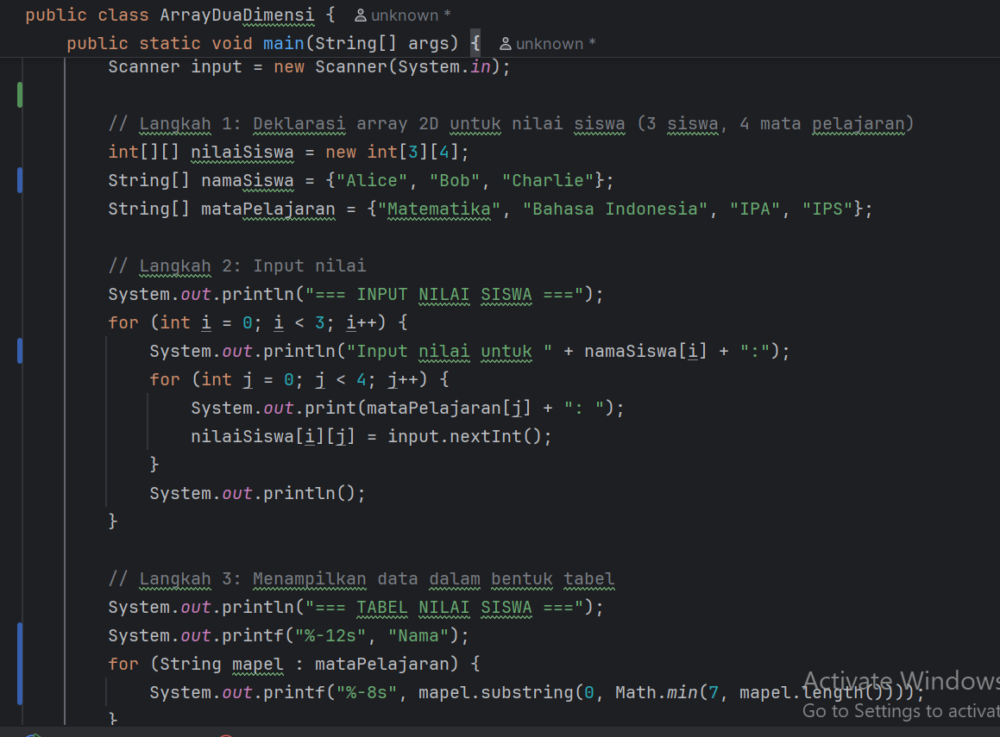
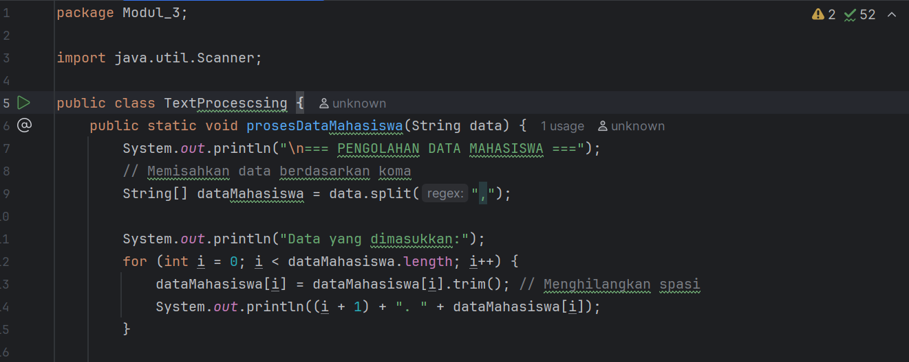
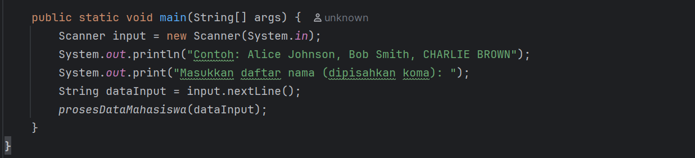
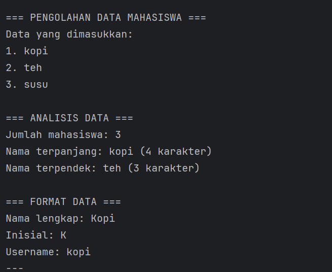

# Laporan Modul 3: Dasar Pemrograman Java lanjutan
**Mata Kuliah:** Praktikum Pemrograman Berorientasi Objek   
**Nama:** Muhammad Luthfi
**NIM:** 2024573010125
**Kelas:** TI.2A

---

## 1. Abstrak
Pada praktikum ini membahas tentang lanjutan dari dasar dasar pemograman Java yang berisi tentang 
penggunaan array, method, dan manipulasi string dalam pemrograman Java.

Tujuan dari praktikum ini adalah memahami dan menerapkan dasar dasar lanjutan dalam pemograman Java.

---
## 2. Praktikum
### Praktikum 1 - Array
#### Dasar Teori
Array adalah suatu struktur data yang digunakan untuk menyimpan banyak data dengan catatan  tipe data yang digunakan sama.

Untuk mengakses elemen dalam array kita menggunakan Index, Index pada Array dimulai dari Index [0].
#### Langkah Praktikum
1.1 Array satu Dimensi

Buat file Java dalam package Modul_3 dengan nama ArraySatuDimensi
lalu masukkan code seperti dibawah:

1.2 Array Dua dimensi
Buat file Java dalam package Modul_3 dengan nama ArrayDuaDimensi
lalu masukkan code seperti dibawah:

#### Screenshoot Hasil
Hasil praktikum 1.1 

Hasil praktikum 1.2

#### Analisa dan Pembahasan
Array bisa digunakan untuk menyimpan data data dengan tipe yang sama,Array 1 dimensi bisa dikatakan meyimpan data
dalam 1 baris, sedangkan Array 2 dimensi menyimpan data dengan bentuk baris dan  kolom
### Praktikum 2 - Method/Function
#### Dasar Teori
Method adalah blok kode yang akan dijalankan ketika di panggil
Kita juga dapat meneruskan data yang dikenal sebagai parameter, ke dalam suatu method. Method digunakan untuk melakukan tindakan tertentu, dan method juga dikenal sebagai function.
Untuk memanggil method di Java, tulis nama method diikuti dengan dua tanda kurung () dan titik koma; Dalam contoh berikut, myMethod() digunakan untuk mencetak teks yang ada di Method.
#### Langkah Praktikum
2.1 Method Dasar

Buat file Java dalam package Modul_3 dengan nama MethodDasar.java
lalu masukkan code seperti dibawah:

2.2 Array Method
Buat file Java dalam package Modul_3 dengan nama ArrayMethod.java
lalu masukkan code seperti dibawah:

#### Screenshoot Hasil
Hasil praktikum 2.1

Hasil praktikum 2.2

#### Analisa dan Pembahasan
Method digunakan untuk memanggil perintah perintah yang terdapat dalam Method saat Method tersebut di jalankan.

### Praktikum 3 - String dan Manipulasi String
#### Dasar Teori
String adalah tipe data yang digunakan untuk merepresentasikan urutan karakter dalam sebuah program.

string dapat didefinisikan sebagai kumpulan karakter yang membentuk urutan tertentu. Karakter dalam string bisa berupa huruf, angka, simbol, dan spasi. Dalam hampir semua bahasa pemrograman, string diapit oleh tanda kutip (tanda kutip tunggal atau ganda) untuk menandai awal dan akhir string
#### Langkah Praktikum
3.1 String  Dasar

Buat file Java dalam package Modul_3 dengan nama StringDasar.java
lalu masukkan code seperti dibawah:

3.2 TextProcessing

Buat file Java dalam package Modul_3 dengan nama TextProcessing.java
lalu masukkan code seperti dibawah:

#### Screenshoot Hasil
Hasil praktikum 3.1

Hasil praktikum 3.2

#### Analisa dan Pembahasan
String digunakan untuk memanipulasi teks, mengelolah dan memanipulasi data.

---

## 3. Kesimpulan

Pada Praktikum ini memeberikan Penjelasan tetang Array yang digunakan sebagai media untuk Menyimpan data dan menglola data dengan tipe yang sama secara efektif, 
method yang dapat memanggil perintah yang dibuat dalam Mathod saat Method tersebut di jalankan,
String yang memungkinkan pengelolaan teks secara fleksibel dengan menggunakan berbagai Method,dan keterkaitan ketiga dasar tersebut.
---

## 5. Referensi
Cantumkan sumber yang Anda baca (buku, artikel, dokumentasi) — minimal 2 sumber. Gunakan format sederhana (judul — URL).

https://tambahpinter.com/perbedaan-array-1-dimensi-dan-2-dimensi/#Perbedaan_antara_Array_1_Dimensi_dan_2_Dimensi

https://www.petanikode.com/java-array/

https://www.w3schools.com/java/java_methods.asp

https://codingstudio.id/blog/string-adalah/