# Laporan Modul 4: Pengenalan Object Oriented Programming
**Mata Kuliah:** Praktikum Pemrograman Berorientasi Objek

**Nama:** Muhammad Luthfi

**NIM:** 2024573010125

**Kelas:** TI.2A

---

## 1. Abstrak
Pada praktikum ini memperkenalkan pengertian OOP,Konsep dasar OOP(yang digunakan dalam OOP),dan cara memanggil sebuah objek
dari class yang di buat dan juga relasi antar class.

penjelasan Tentang apa itu OOP :
OOP adalah paradigma pemrograman yang berfokus pada penggunaan “objek” untuk merepresentasikan data dan fungsi-fungsi yang bekerja dengan data tersebut.
---
## 2. Praktikum
### Praktikum 1 - Membuat Class dan objek mengunakan constructor
#### Dasar Teori
Class adalah konsep dasar dalam pemrograman berbasis objek (OOP) yang berfungsi sebagai cetak biru atau blueprint untuk menciptakan objek, membuat pemrograman menjadi lebih terstruktur dan efisien.

Object merupakan unit dasar object oriented programming (OOP), mewakili entitas kehidupan nyata dari sebuah class
Suatu object memiliki identitas, keadaan, dan perilaku serta berisi data dan kode untuk memanipulasi data.

Constructor adalah method khusus yang akan dijalankan secara otomatis pada saat sebuah objek dibuat (instansiasi), yakni ketika perintah "new" dijalankan.
#### Langkah Praktikum
Buat package Modul_4 lalu tambahkan file Java dalam package Modul_4 dengan nama Mahasiswa
lalu masukkan code seperti dibawah:
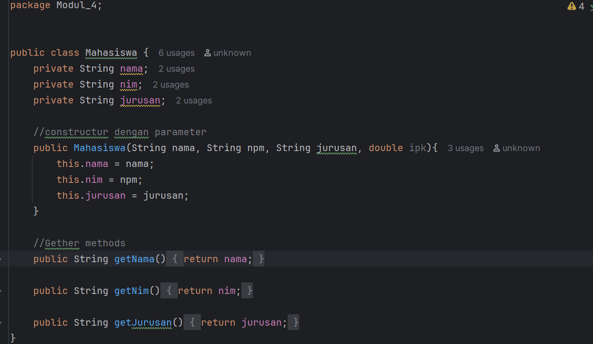

tambahkan file Java dalam package Modul_4 dengan nama MataKuliah
lalu masukkan code seperti dibawah:
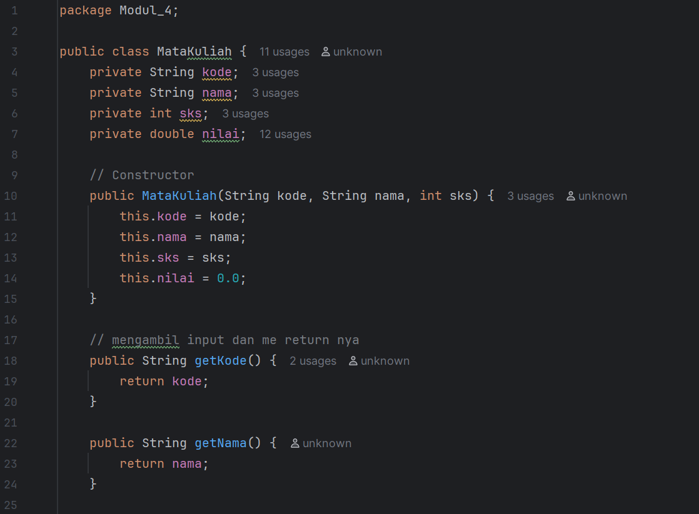
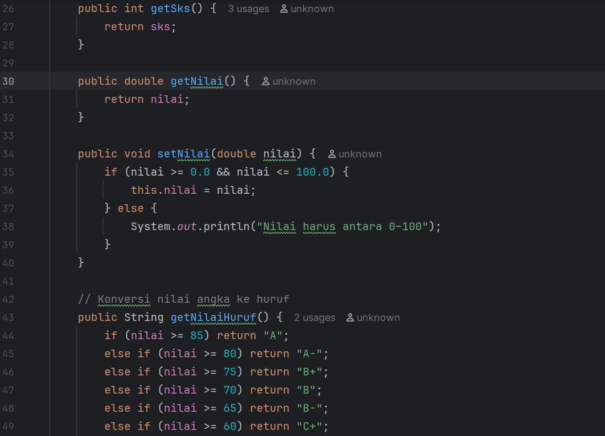
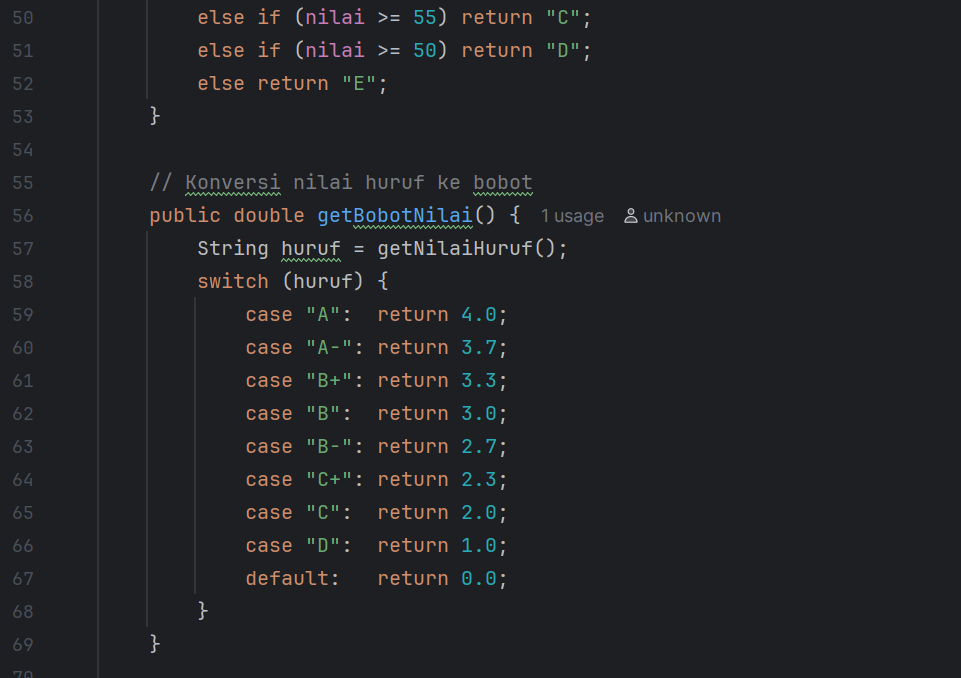
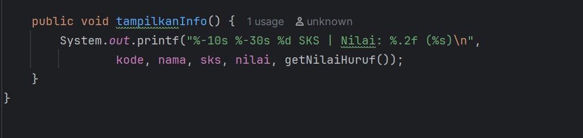

tambahkan file Java dalam package Modul_4 dengan nama RencanaKartuStudi
lalu masukkan code seperti dibawah:
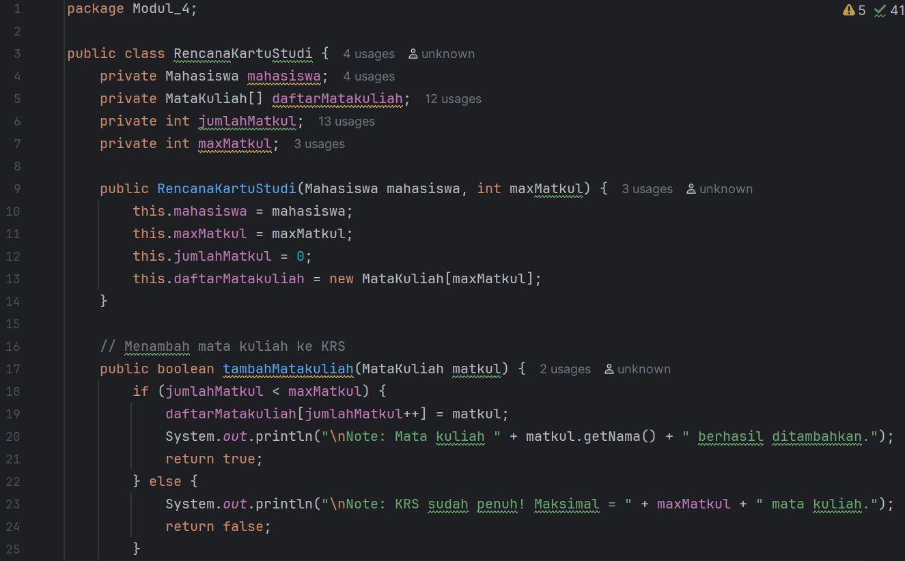
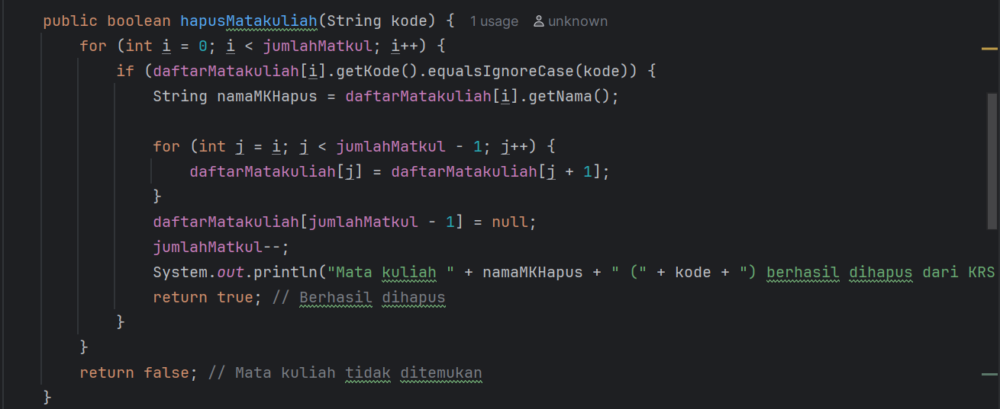
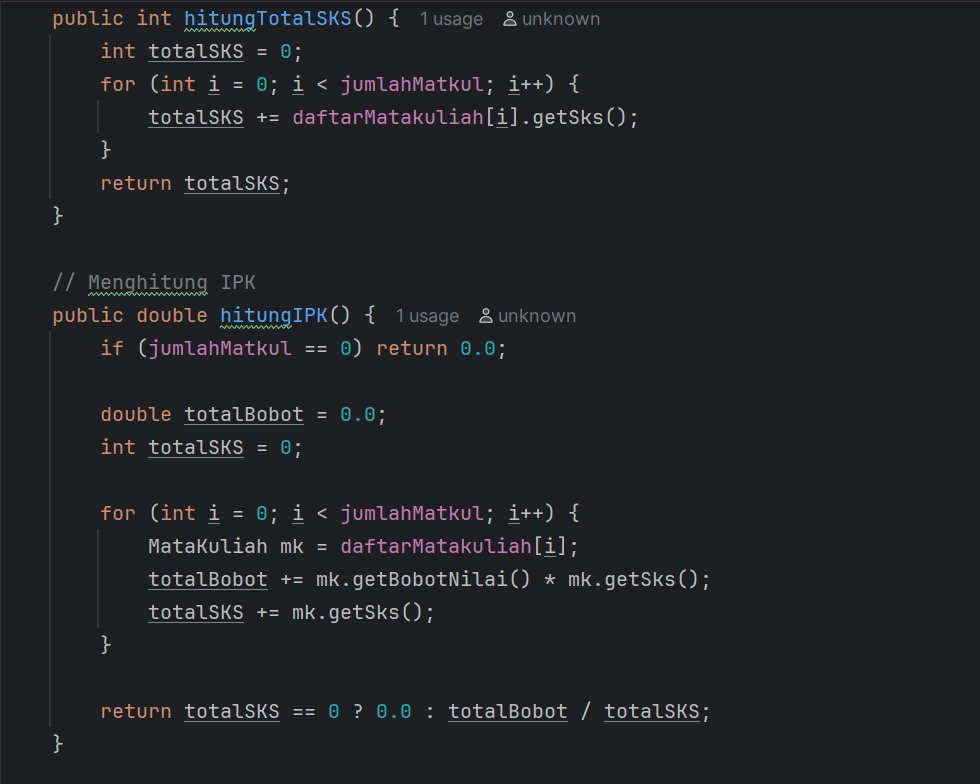
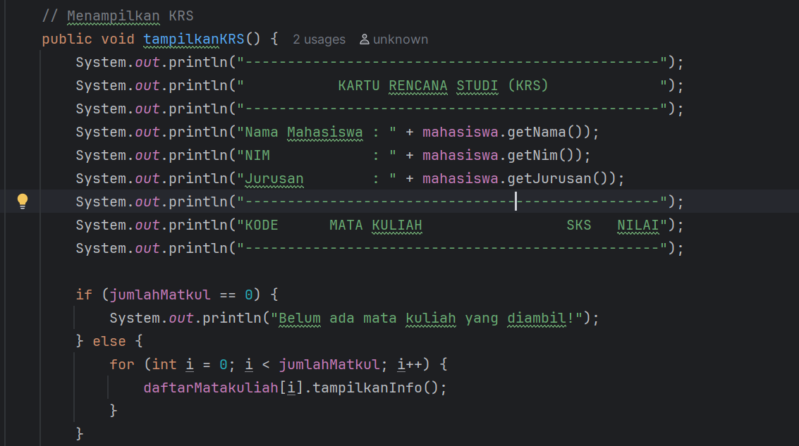
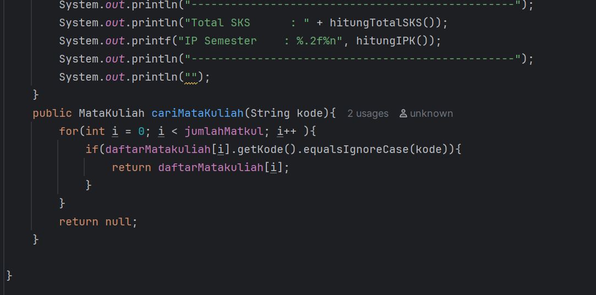
tambahkan file Java dalam package Modul_4 dengan nama Main untuk menguji class dan objek yang telah di buat 
lalu masukkan code seperti dibawah:

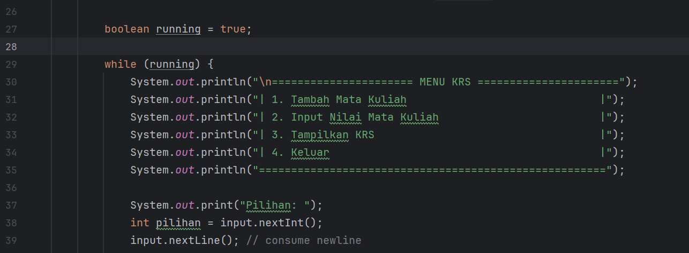
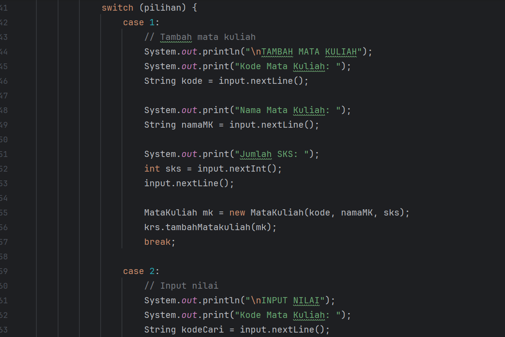
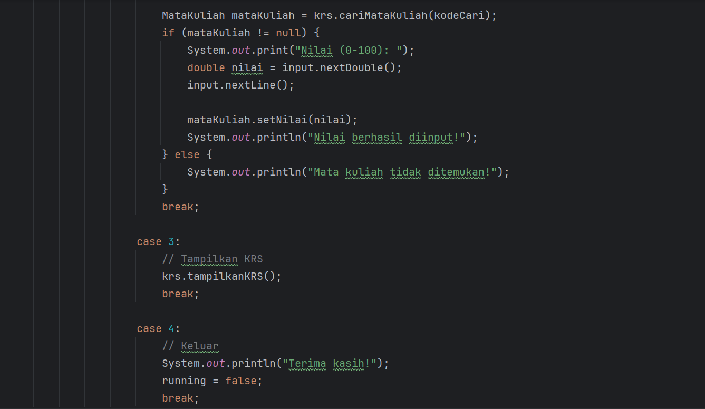
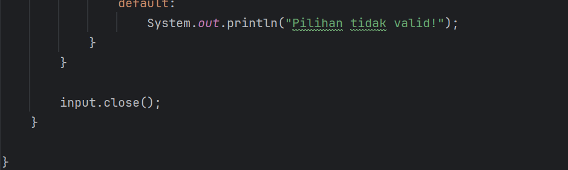
#### Screenshoot Hasil
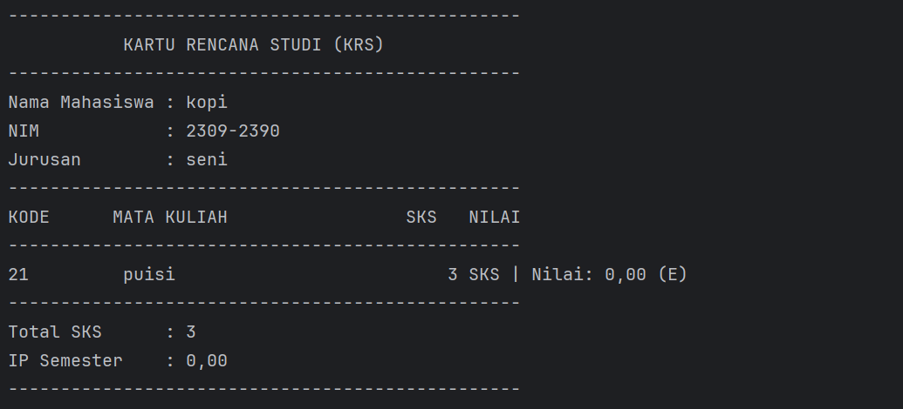
#### Analisa dan Pembahasan
Pada praktikum ini kita membuat class mahasiswa,matakuliah,rencanakartustudi dan menguji semua class tersebut dalam Main

Agar setiap class tersebut saling terhubung class mahasiswa dan class matakuliah di pakai dalam class rencankartustudi.

---

## 3. Kesimpulan

Praktikum ini memberikan pengenalan tentang cara membuat class, menggunakan constructor untuk menginisialisasi sebuah objek 

---

## 5. Referensi
Cantumkan sumber yang Anda baca (buku, artikel, dokumentasi) — minimal 2 sumber. Gunakan format sederhana (judul — URL).

https://www.dicoding.com/blog/mengenal-oop-konsep-dan-contoh/#:~:text=Object%20Oriented%20Programming%20(OOP)%20adalah,Sampai%20jumpa%20dalam%20artikel%20lainnya.

https://www.revou.co/kosakata/class#:~:text=Berbasis%20Objek%20(OOP)-,Class%20adalah%20konsep%20dasar%20dalam%20pemrograman%20berbasis%20objek%20(OOP)%20yang,arsitek%20untuk%20membangun%20sebuah%20rumah.

https://www.duniailkom.com/tutorial-belajar-oop-php-pengertian-constructor-dan-destructor/#:~:text=33%20Comments,-Ade%20Dwi%20Putra&text=Constructor%20cukup%20sering%20dipakai%20gan,perlu%20menghapus%20objek%20secara%20manual

https://kelas.work/blogs/pelajari-struktur-dan-prinsip-object-oriented-programming-atau-oop#:~:text=Object%20merupakan%20unit%20dasar%20object,respon%20yang%20dikembalikan%20oleh%20object

---