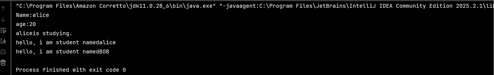
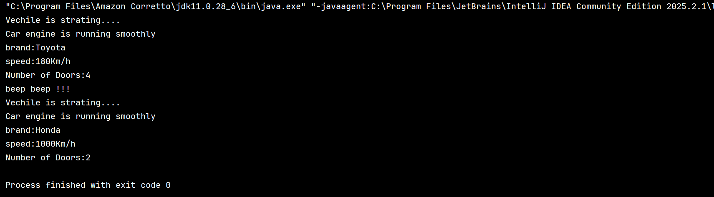
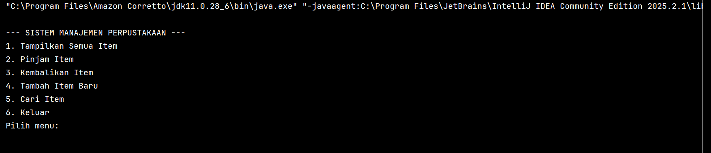

# Laporan Modul 6: Inheritance
**Mata Kuliah:** Praktikum Pemrograman Berorientasi Objek   
**Nama:** Muhammad Luthfi 
**NIM:**  2024573010125
**Kelas:** TI.2A

---

## 1. Abstrak
Laporan ini membarikan penjelasan dari salah satu poin utama dari OOP yaitu Inheritance 
yang di dalam modul menjelaskan jenis-jenis Inherintance yaitu Single Inheritance, Multiple Inheritance,Hierarchical Inheritance,Multilevel Inheritance dan Hybrid Inheritance.

tujuan dari praktikum ini adalah memahami bagaimana konsep dan mekanisme  Inherintance bekerja.

---
## 2. Praktikum
### Praktikum 1 - Memahami Single Inheritance
#### Dasar Teori
Single inheritance adalah bentuk paling sederhana di mana sebuah subclass hanya mewarisi satu superclass.
#### Langkah Praktikum
Buat class Person sebagai superclass:

    public class Person {
    protected  String name;
    protected  int age ;
    public Person(String name, int age){
    this.name = name;
      this.age = age;
       }
    public void displayInfo(){
        System.out.println("Name:" + name);
        System.out.println("age:"+age);
    }
    public void greet(){
        System.out.println("hello, iam a person");
    }
    }
2.Buat class Student sebagai subclass yang mewarisi Person:

    public class Student extends Person {
    private String StudenId;
    public Student(String name, int age, String StudentId){
        super(name,age);
        this.StudenId = StudentId;
    }
    public void study(){
        System.out.println(name + "is studying.");
    }
    @Override
    public void greet(){
        System.out.println("hello, i am student named"+ name);
    }
    }

3.Buat class InheritanceTest untuk testing:

    public class InheritanceTest {
    public static void main(String[] args){
    Student student = new Student("alice",20,"178273");

        // method superclass
        student.displayInfo();

        //method subclass
        student.study();
        // memanggil override method
        student.greet();

        // polymorphism: Student sebagai person
        Person person = new Student("BOB",22,"3235236");
        person.greet();
    }
    }
#### Screenshoot Hasil

#### Analisa dan Pembahasan
Pada praktikum diatas Single Inheritance yang menurut teori adalah subclass mewarisi 1 superclass yang dimana person adalah superclass yang meng Inherin Student sebagai subclass

### Praktikum 2 -  Method Overriding dan Kata Kunci super
#### Dasar Teori
Method Overriding,dalam pemrograman berorientasi objek , adalah fitur bahasa yang memungkinkan subkelas atau kelas anak untuk menyediakan implementasi spesifik dari suatu metode yang sudah disediakan oleh salah satu superkelas atau kelas induknya.

Dalam pengembangan perangkat lunak berbasis Java, mengakses sifat dan metode dari kelas induk (superclass) menggunakan kata kunci `super` adalah strategi yang esensial untuk memanfaatkan konsep inheritance secara efektif. Dengan `super`, subclass dapat mengambil keuntungan dari atribut dan metode yang telah didefinisikan di superclass tanpa perlu mendefinisikan ulang, menciptakan pengelolaan kode yang lebih efisien dan konsisten.
#### Langkah Praktikum
1.Buat class Vehicle sebagai superclass:

    public class Vehicle {
    protected String brand;
    protected  int speed;

    public Vehicle(String brand, int speed){
        this.brand = brand;
        this.speed = speed;
    }
    public void start(){
        System.out.println("Vechile is strating....");
    }
    public void dispalyInfo(){
        System.out.println("brand:"+brand);
        System.out.println("speed:"+ speed + "Km/h");
    }
    }
2.Buat class Car sebagai subclass yang mewarisi Vehicle:

     public class Car extends Vehicle {
     private int numberOfDoors;
     public Car(String brand, int speed, int numberOfDoors){
     super(brand, speed);
     this.numberOfDoors=numberOfDoors;
    }

    @Override
    public void start() {
        super.start();
        System.out.println("Car engine is running smoothly");
    }
    @Override
    public void dispalyInfo(){
        super.dispalyInfo();
        System.out.println("Number of Doors:" + numberOfDoors);
    }
    public void honk(){
        System.out.println("beep beep !!!");
    }
    }
3.Buat class OverrideTest untuk testing:

    public class OverrideTest {
    public static void main(String[] args){
    Car car = new Car("Toyota",180,4);

        car.start();
        car.dispalyInfo();
        car.honk();

        Vehicle vechile = new Car("Honda",1000,2);
        vechile.start();
        vechile.dispalyInfo();
    }
    }
#### Screenshoot Hasil

#### Analisa dan Pembahasan
pada praktikum ini menjelaskan bahwa method pada Vehicle sebagai superclass di pakai kembali oleh subclass yaitu car yang mewarisi method dari superclass.

### Praktikum 3 -   Multilevel dan Hierarchical Inheritance
#### Dasar Teori
multilevel inheritance memungkinkan subclass menjadi superclass untuk subclass lainnya, menciptakan tingkatan yang lebih dalam dalam hierarki.

Hierarchical inheritance memungkinkan beberapa subclass untuk mewarisi dari satu superclass yang sama, memfasilitasi pembagian karakteristik dan perilaku yang terkait dalam kelompok yang berbeda.
#### Langkah Praktikum
1.Buat class Animal sebagai superclass:

    public class Animal {
    protected String name;
    public Animal(String name){
    this.name = name;
    }
    public  void eat(){
    System.out.println(name +"is eating");
    }
    public  void sleep(){
    System.out.println(name + "is sleeping");
    }
    }
2.Buat class Mammal yang mewarisi Animal (multilevel inheritance):

    public class Mammal extends Animal {
    protected String furColor;

    public Mammal(String name,String furColor){
        super(name);
        this.furColor = furColor;
    }

    public void giveBirth(){
        System.out.println(name + " is giving birth to live young");
        }
    }

3.Buat class Dog yang mewarisi Mammal (multilevel inheritance):

     public class Dog extends Mammal{
    private String breed;

    public Dog(String name, String furColor, String breed){
        super(name, furColor);
        this.breed= breed;
    }
    public void bark(){
        System.out.println(name+ "is barking: Woof Woof!");
    }
    @Override
    public void eat(){
        System.out.println(name+" the dog is eating dog food");
    }
    }

4.Buat class Cat yang mewarisi Mammal (hierarchical inheritance):

    public class Cat extends Mammal{
    private boolean isIndoor;

    public Cat(String name,String furcolor,boolean isIndoor){
        super(name,furcolor);
        this.isIndoor=isIndoor;
    }
    public void meow(){
        System.out.println(name+" is meowing : Meow meow!");
    }
    @Override
    public void eat(){
        System.out.println(name+" the cat is eating cat food.");
    }
    }

5.Buat class InheritanceTypeTest untuk testing:

     public class InheritanceTypeTest {
     public static  void main(String[] args) {
     Dog dog = new Dog("Buddy", "Brown", "Golden Retviered");
     dog.eat();
      dog.sleep();
     dog.giveBirth();
     dog.bark();
        System.out.println();

        Cat cat = new Cat("Whitetaker", "white", true);
        cat.eat();
        cat.sleep();
        cat.giveBirth();
        cat.meow();

        System.out.println();

        Animal[] animals = {new Dog("Max","Black","labrador"),
                new Cat ("Luna","Gray",false)};

        for (Animal animal : animals){
            animal.eat();
        }
    }
    }

#### Screenshoot Hasil

#### Analisa dan Pembahasan
Pada praktikum ini kita membahas 2 jenis Inherintance yaitu  Multilevel dan Hierarchical Inheritance yang dimana class Mammal sebenarnya adalah subclass dari hewan namun menjadi
superclass untuk subclass Dog dan Cat yang dimana 2 subclass terhubung dengan 2 superclass yaitu animal dan mammal

### Praktikum 4 -  Sistem Manajemen Perpustakaan Sederhana
#### Langkah Praktikum
1.Buat class LibraryItem sebagai superclass:

    public abstract class LibraryItem {

    protected String itemId;
    protected String title;
    protected int year;
    protected boolean isAvailable;

    public LibraryItem(String itemId, String title, int year) {
        this.itemId = itemId;
        this.title = title;
        this.year = year;
        this.isAvailable = true;
    }

    // Getter methods
    public String getItemId() { return itemId; }
    public String getTitle() { return title; }
    public int getYear() { return year; }
    public boolean isAvailable() { return isAvailable; }

    // Setter methods
    public void setAvailable(boolean available) { isAvailable = available; }

    // Abstract method yang harus diimplementasikan subclass
    public abstract void displayInfo();

    // Concrete method yang bisa digunakan semua subclass
    public void borrowItem() {
        if (isAvailable) {
            isAvailable = false;
            System.out.println(title + " berhasil dipinjam");
        } else {
            System.out.println(title + " sedang tidak tersedia");
        }
    }

    public void returnItem() {
        isAvailable = true;
        System.out.println(title + " berhasil dikembalikan");
    }
    }
2.Buat class Book yang mewarisi LibraryItem:

     public class Book extends LibraryItem {
     private String author;
     private String isbn;
     private int numberOfPages;

    public Book(String itemId, String title, int year, String author, String isbn, int numberOfPages) {
        super(itemId, title, year);
        this.author = author;
        this.isbn = isbn;
        this.numberOfPages = numberOfPages;
    }

    @Override
    public void displayInfo() {
        System.out.println("BUKU");
        System.out.println("---------------------------");
        System.out.println("ID: " + itemId);
        System.out.println("Judul: " + title);
        System.out.println("Penulis: " + author);
        System.out.println("Tahun: " + year);
        System.out.println("ISBN: " + isbn);
        System.out.println("Jumlah Halaman: " + numberOfPages);
        System.out.println("Status: " + (isAvailable ? "Tersedia" : "Dipinjam"));
        System.out.println("---------------------------");
    }

    // Method khusus Book
    public void readSample() {
        System.out.println("Membaca sample dari buku: " + title);
    }
    }

3.Buat class Magazine yang mewarisi LibraryItem:

    public class Magazine extends LibraryItem {
    private String publisher;
    private int issueNumber;
    private String category;

    public Magazine(String itemId, String title, int year, String publisher, int issueNumber, String category) {
        super(itemId, title, year);
        this.publisher = publisher;
        this.issueNumber = issueNumber;
        this.category = category;
    }

    @Override
    public void displayInfo() {
        System.out.println("-------- MAJALAH --------");
        System.out.println("ID: " + itemId);
        System.out.println("Judul: " + title);
        System.out.println("Penerbit: " + publisher);
        System.out.println("Tahun: " + year);
        System.out.println("Edisi: " + issueNumber);
        System.out.println("Kategori: " + category);
        System.out.println("Status: " + (isAvailable ? "Tersedia" : "Dipinjam"));
        System.out.println("-------------------------");
    }

    // Method khusus Magazine
    public void browseArticles() {
        System.out.println("Menelusuri artikel dalam majalah: " + title);
    }
    }

4.Buat class DVD yang mewarisi LibraryItem:

    public class DVD extends LibraryItem {
    private String director;
    private int duration; // dalam menit
    private String genre;

    public DVD(String itemId, String title, int year, String director, int duration, String genre) {
        super(itemId, title, year);
        this.director = director;
        this.duration = duration;
        this.genre = genre;
    }

    @Override
    public void displayInfo() {
        System.out.println("---- DVD ----");
        System.out.println("ID: " + itemId);
        System.out.println("Judul: " + title);
        System.out.println("Sutradara: " + director);
        System.out.println("Tahun: " + year);
        System.out.println("Durasi: " + duration + " menit");
        System.out.println("Genre: " + genre);
        System.out.println("Status: " + (isAvailable ? "Tersedia" : "Dipinjam"));
        System.out.println("---------------------------");
    }

    // Method khusus DVD
    public void playTrailer() {
        System.out.println("Memutar trailer DVD: " + title);
    }
    }

5.Buat class LibraryManagementSystem sebagai main class:

    import java.util.ArrayList;
    import java.util.Scanner;
    public class LibraryManagementSystem {

    private static ArrayList<LibraryItem> libraryItems = new ArrayList<>();
    private static Scanner scanner = new Scanner(System.in);

    public static void main(String[] args) {
        initializeSampleData();

        while (true) {
            displayMenu();
            int choice = scanner.nextInt();
            scanner.nextLine(); // consume newline

            switch (choice) {
                case 1:
                    displayAllItems();
                    break;
                case 2:
                    borrowItem();
                    break;
                case 3:
                    returnItem();
                    break;
                case 4:
                    addNewItem();
                    break;
                case 5:
                    searchItem();
                    break;
                case 6:
                    System.out.println("Terima kasih telah menggunakan sistem perpustakaan!");
                    return;
                default:
                    System.out.println("Pilihan tidak valid!");
            }
        }
    }

    private static void displayMenu() {
        System.out.println("\n--- SISTEM MANAJEMEN PERPUSTAKAAN ---");
        System.out.println("1. Tampilkan Semua Item");
        System.out.println("2. Pinjam Item");
        System.out.println("3. Kembalikan Item");
        System.out.println("4. Tambah Item Baru");
        System.out.println("5. Cari Item");
        System.out.println("6. Keluar");
        System.out.print("Pilih menu: ");
    }

    private static void initializeSampleData() {
        // Tambahkan sample data
        libraryItems.add(new Book("B001", "Pemrograman Java", 2023, "Budi Santoso", "978-1234567890", 350));
        libraryItems.add(new Book("B002", "Struktur Data", 2022, "Sari Dewi", "978-0987654321", 280));
        libraryItems.add(new Magazine("M001", "National Geographic", 2024, "NG Media", 245, "Sains"));
        libraryItems.add(new DVD("D001", "The Java Documentary", 2023, "John Programmer", 120, "Edukasi"));
    }

    private static void displayAllItems() {
        System.out.println("\n--- DAFTAR SEMUA ITEM PERPUSTAKAAN ---");
        for (LibraryItem item : libraryItems) {
            item.displayInfo();
            System.out.println();
        }
    }

    private static void borrowItem() {
        System.out.print("Masukkan ID item yang ingin dipinjam: ");
        String itemId = scanner.nextLine();

        for (LibraryItem item : libraryItems) {
            if (item.getItemId().equalsIgnoreCase(itemId)) {
                item.borrowItem();
                return;
            }
        }
        System.out.println("Item dengan ID " + itemId + " tidak ditemukan!");
    }

    private static void returnItem() {
        System.out.print("Masukkan ID item yang ingin dikembalikan: ");
        String itemId = scanner.nextLine();

        for (LibraryItem item : libraryItems) {
            if (item.getItemId().equalsIgnoreCase(itemId)) {
                item.returnItem();
                return;
            }
        }
        System.out.println("Item dengan ID " + itemId + " tidak ditemukan!");
    }

    private static void addNewItem() {
        System.out.println("\n--- TAMBAH ITEM BARU ---");
        System.out.println("1. Buku");
        System.out.println("2. Majalah");
        System.out.println("3. DVD");
        System.out.print("Pilih jenis item: ");
        int type = scanner.nextInt();
        scanner.nextLine();

        System.out.print("ID Item: ");
        String itemId = scanner.nextLine();
        System.out.print("Judul: ");
        String title = scanner.nextLine();
        System.out.print("Tahun: ");
        int year = scanner.nextInt();
        scanner.nextLine();

        switch (type) {
            case 1:
                System.out.print("Penulis: ");
                String author = scanner.nextLine();
                System.out.print("ISBN: ");
                String isbn = scanner.nextLine();
                System.out.print("Jumlah Halaman: ");
                int pages = scanner.nextInt();
                libraryItems.add(new Book(itemId, title, year, author, isbn, pages));
                break;
            case 2:
                System.out.print("Penerbit: ");
                String publisher = scanner.nextLine();
                System.out.print("Edisi: ");
                int issue = scanner.nextInt();
                scanner.nextLine();
                System.out.print("Kategori: ");
                String category = scanner.nextLine();
                libraryItems.add(new Magazine(itemId, title, year, publisher, issue, category));
                break;
            case 3:
                System.out.print("Sutradara: ");
                String director = scanner.nextLine();
                System.out.print("Durasi (menit): ");
                int duration = scanner.nextInt();
                scanner.nextLine();
                System.out.print("Genre: ");
                String genre = scanner.nextLine();
                libraryItems.add(new DVD(itemId, title, year, director, duration, genre));
                break;
            default:
                System.out.println("Jenis item tidak valid!");
                return;
        }
        System.out.println("Item berhasil ditambahkan!");
    }

    private static void searchItem() {
        System.out.print("Masukkan kata kunci pencarian (judul/penulis): ");
        String keyword = scanner.nextLine().toLowerCase();

        System.out.println("\n--- HASIL PENCARIAN ---");
        boolean found = false;

        for (LibraryItem item : libraryItems) {
            if (item.getTitle().toLowerCase().contains(keyword)) {
                item.displayInfo();
                System.out.println();
                found = true;
            }
        }

        if (!found) {
            System.out.println("Tidak ada item yang sesuai dengan pencarian.");
        }
    }
    }

#### Screenshoot Hasil

---

## 3. Kesimpulan

Pada modul Inherintance ini menegaskan bahwa Inherintance adalah salah satu prinsip fundamental dalam Object-Oriented Programming (OOP) yang memungkinkan sebuah class (subclass/child class) mewarisi sifat dan perilaku dari class lain (superclass/parent class)
dan Inherintance terbagi menjadi beberapa jenis dan pewarisan itu tidak hanya class saja namun method juga dapat di turunkan dengan overiding.
---

## 5. Referensi

https://biztechacademy.id/mengenal-inheritance-penerusan-sifat-di-java/#:~:text=Jenis%2Djenis%20Inheritance%20Dalam%20Java,cara%20yang%20efisien%20dan%20terstruktur.

https://en.wikipedia.org/wiki/Method_overriding

---
