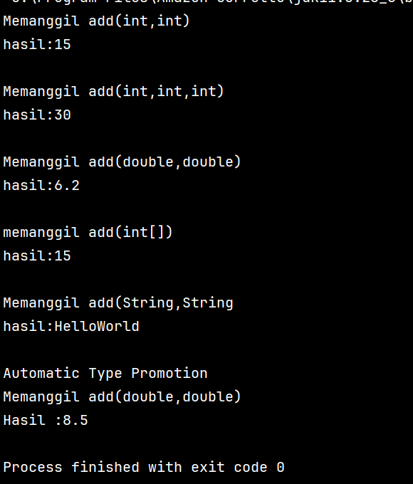
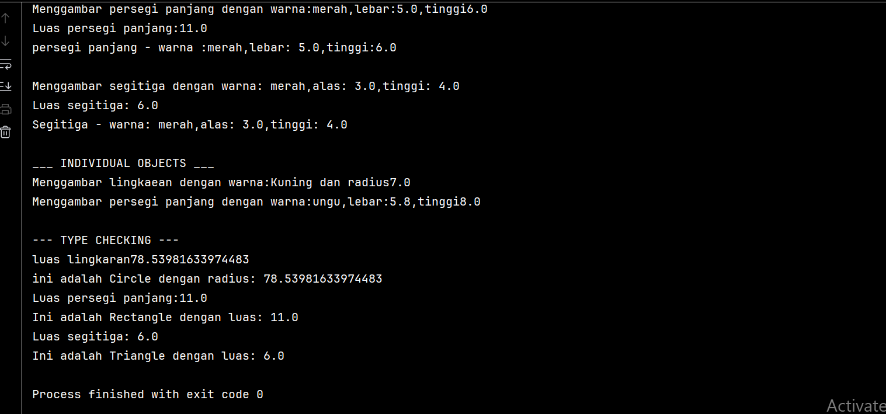

# Laporan Modul 7: polymorphism
**Mata Kuliah:** Praktikum Pemrograman Berorientasi Objek   
**Nama:** Muhammad Luthfi
**NIM:**  2024573010125
**Kelas:** TI.2A

---

## 1. Abstrak
Pada praktikum ini membahas tentang salah satu pondasi dalam PBO(Pemrograman Berorientasi Objek)
yaitu Polymorphism didefinisikan sebagai kemampuan untuk menggunakan antarmuka tunggal pada entitas yang berbeda, memungkinkan variabel, fungsi, atau objek mengambil berbagai bentuk, terutama dalam hierarki kelas yang diwarisi dari kelas induk yang sama.

Tujuan utama dari penerapan Polymorphism meliputi peningkatan Fleksibilitas, Dapat Digunakan Kembali Kode (Code Reusability), dan Kemudahan Pemeliharaan (Maintainability), serta memungkinkan Perilaku Dinamis objek yang ditentukan saat runtime.

---
## 2. Praktikum
### Praktikum 1 - Memahami Method Overloading (Compile-time Polymorphism)
#### Dasar Teori
method overloading adalah membuat beberapa method dengan nama yang sama, tapi dibedakan dari jumlah dan/atau tipe parameter.

#### Langkah Praktikum
1.Buat class Calculator dengan method overloading:

    public class Calculator {
    public int add(int a, int b){
        System.out.println("Memanggil add(int,int)");
        return a+b;
    }

    public int add(int a, int b, int c){
        System.out.println("Memanggil add(int,int,int)");
        return a+b+c;
    }

    public double add(double a, double b){
        System.out.println("Memanggil add(double,double)");
        return a+b ;
    }
    public int add(int[] numbers){
        System.out.println("memanggil add(int[])");
        int sum =0;
        for(int num: numbers){
            sum+=num;
        }
        return sum;
    }
    public String add(String a, String b){
        System.out.println("Memanggil add(String,String");
        return a+b;
    }
    }

2.Buat class OverloadingTest untuk testing:

    public class OverloadingTest {
    public static void main(String[] args){
    Calculator calc = new Calculator();

        System.out.println("hasil:" + calc.add(5,10));
        System.out.println();

        System.out.println("hasil:" + calc.add(5,10,15));
        System.out.println();

        System.out.println("hasil:" + calc.add(3.5,2.7));
        System.out.println();

        int[] numbers = {1,2,3,4,5};
        System.out.println("hasil:" + calc.add(numbers));
        System.out.println();

        System.out.println("hasil:" + calc.add("Hello","World"));
        System.out.println();

        System.out.println("Automatic Type Promotion");
        System.out.println("Hasil :" + calc.add(5,3.5)); // int + double
    }
    }

#### Screenshoot Hasil

#### Analisa dan Pembahasan
pada praktikum ini kita membuat 1 method yang sama yaitu add tetapi dengan parameter yang berbeda,yang dimana kita hanya perlu masukkan 1 nilai maka method add yang dipakai akan menyesuaikan.

### Praktikum 2 - Memahami Method Overriding (Runtime Polymorphism)
#### Dasar Teori
Method Overriding,dalam pemrograman berorientasi objek , adalah fitur bahasa yang memungkinkan subkelas atau kelas anak untuk menyediakan implementasi spesifik dari suatu metode yang sudah disediakan oleh salah satu superkelas atau kelas induknya.
#### Langkah Praktikum
1.Buat class Shape sebagai superclass:

    public class Shape {
    protected String color;

    public Shape(String color){
        this.color=color;
    }

    public void draw(){
        System.out.println("Menggambar shape dengan warna");
    }
    public double calculatorArea(){
        System.out.println("Menghitung luas shape umum");
        return 0.0;
    }

    public void displayInfo(){
        System.out.println("Shape-warna" + color );
    }
    }

2.Buat class Circle yang mewarisi Shape:

    public class Circle extends Shape {
    private  double radius;

    public Circle(String color, double radius){
        super(color);
        this.radius = radius;
    }
    @Override
    public void draw(){
        System.out.println("Menggambar lingkaean dengan warna:"+ color +" dan radius"+ radius);
    }
    @Override
    public double calculatorArea(){
        double area = Math.PI * radius * radius;
        System.out.println("luas lingkaran"+ area);
        return area;
    }
    @Override
    public void displayInfo(){
        System.out.println("Lingkaran - warna:"+ color +",radius"+ radius);
    }
    }

3.Buat class Rectangle yang mewarisi Shape:

    public class Rectangle extends  Shape {
    private double widht;
    private double height;

    public Rectangle(String color, double widht,double height){
        super(color);
        this.widht= widht;
        this.height=height;
    }
    @Override
    public void draw(){
        System.out.println("Menggambar persegi panjang dengan warna:"+ color +",lebar:"+widht+",tinggi"+height);
    }
    @Override
    public double calculatorArea(){
        double area = widht + height;
        System.out.println("Luas persegi panjang:"+area);
        return area;
    }

    @Override
    public void displayInfo(){
        System.out.println("persegi panjang - warna :"+ color + ",lebar: "+widht+",tinggi:"+height);
    }
    }

4.Buat class Triangle yang mewarisi Shape:

    public class Triangle extends Shape{
    private double base;
    private double height;

    public Triangle(String color, double base, double height){
        super(color);
        this.base=base;
        this.height=height;
    }
    @Override
    public void draw(){
        System.out.println("Menggambar segitiga dengan warna: "+color+",alas: "+base+",tinggi: "+height);
    }
    @Override
    public double calculatorArea(){
        double area =0.5 *base*height;
        System.out.println("Luas segitiga: "+ area);
        return area;
    }
    @Override
    public void displayInfo(){
        System.out.println("Segitiga - warna: "+color+",alas: "+base+",tinggi: "+height);
    }
    }

5.Buat class PolymorphismTest untuk testing:

    public class PolymorphismTest {
    public static void main(String[] args){
    Shape[] shapes = new Shape[3];
    shapes[0] = new Circle("merah",5.0);
    shapes[1] = new Rectangle("merah",5.0,6.0);
    shapes[2] = new Triangle("merah",3.0,4.0);

        System.out.println("___ POLIMORFISME RUNTIME ___ ");
        for(Shape shape : shapes){
            shape.draw();
            shape.calculatorArea();
            shape.displayInfo();
            System.out.println();
        }
        System.out.println("___ INDIVIDUAL OBJECTS ___");
        Shape shape1= new Circle("Kuning",7.0);
        Shape shape2 = new Rectangle("ungu",5.8,8.0);

        shape1.draw();
        shape2.draw();

        System.out.println("\n--- TYPE CHECKING ---");
        for (Shape shape: shapes){
            if(shape instanceof Circle){
                Circle circle = (Circle) shape;
                System.out.println("ini adalah Circle dengan radius: "+ circle.calculatorArea());
            } else if (shape instanceof  Rectangle) {
                Rectangle rectangle=(Rectangle) shape;
                System.out.println("Ini adalah Rectangle dengan luas: "+ rectangle.calculatorArea());
            } else if (shape instanceof  Triangle) {
                Triangle triangle=(Triangle) shape;
                System.out.println("Ini adalah Triangle dengan luas: "+ triangle.calculatorArea());

            }
        }
    }
    }

#### Screenshoot Hasil

#### Analisa dan Pembahasan
Pada praktikum ini terdiri dari 1 superclass(Shape) dan 3 subclass(Circle, Rectangle, dan Triangle) yang dimana ketiga class tersebut memiliki
3 method yang sama yaitu draw(),calculatorArea(),displayInfo(),namun dengan parameter yang berbeda di masing masing class

---

## 3. Kesimpulan

pada praktiku ini kita membahs tentang polumorphism yang digunkan untuk membuat code yang berstruktur dan adaptif.
polymorphism memiliki 2 cara yaitu:
1.Method Overloading, di mana compiler menentukan metode yang tepat berdasarkan tanda tangan (signature) yang berbeda.
2.Method Overriding (Polimorfisme Runtime), di mana pemanggilan metode ditentukan secara dinamis saat program berjalan, memastikan bahwa implementasi spesifik dari subclass dieksekusi meskipun diakses melalui referensi superclass.

---

## 5. Referensi

https://www.duniailkom.com/tutorial-oop-java-pengertian-method-overloading/

https://en.wikipedia.org/wiki/Method_overriding

---
