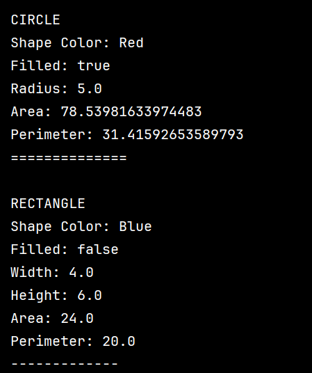
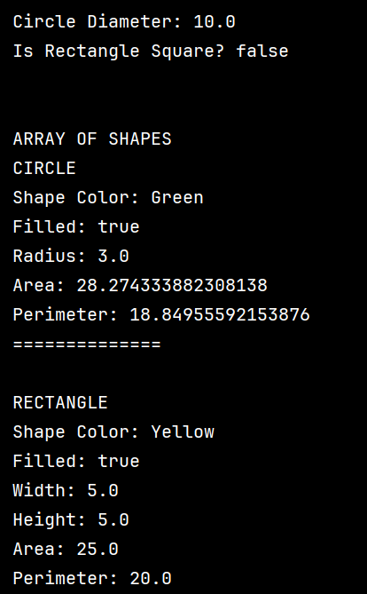
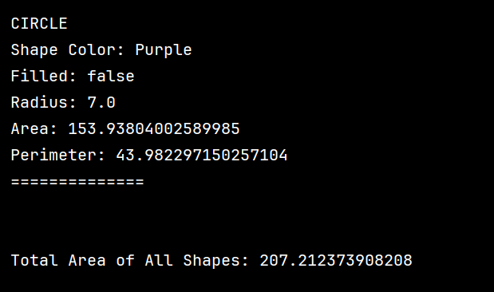
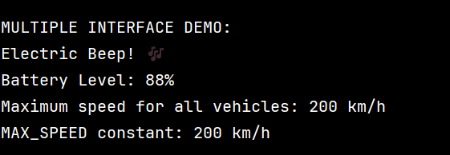
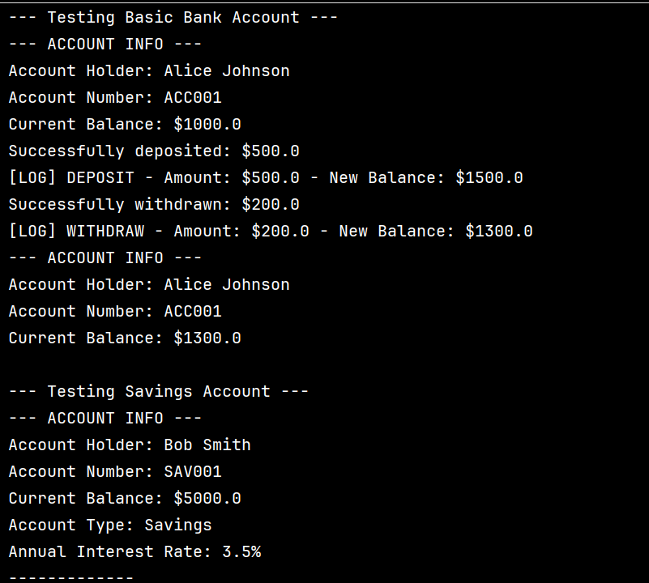
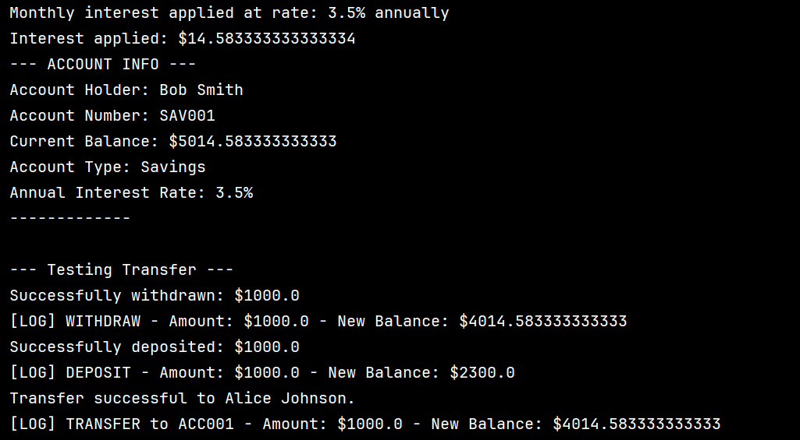
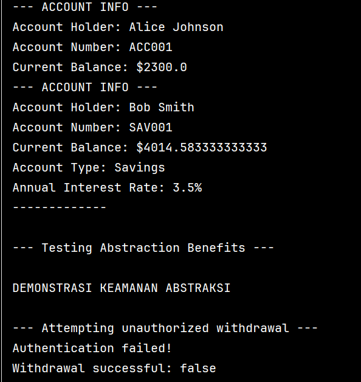
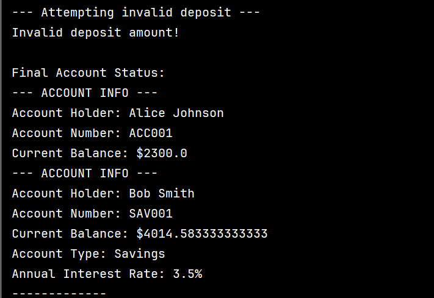

# Laporan Modul 8: Abstraction
**Mata Kuliah:** Praktikum Pemrograman Berorientasi Objek  

**Nama:** Muhammad Luthfi
**NIM:**  2024573010125
**Kelas:** TI.2A

---

## 1. Abstrak
Abstraksi adalah salah satu konsep utama dalam Pemrograman Berorientasi Objek (OOP) yang bertujuan untuk menyederhanakan sistem yang rumit dengan cara menyembunyikan semua detail teknis yang tidak perlu dari pandangan pengguna.

Contoh abstraction seperti kita menekan tombol on pada remote TV maka TV akan menyala tanpa kita mengetahui proses yang di lakukan oleh TV setelah kita menekan tombol on pada remote.

Inti nya abstraction menyajikan "apa" yang terjadi bukan "bagaimana" bisa terjadi.

---
## 2. Praktikum

### Praktikum 1 - Memahami Abstract Class dan Abstract Method
#### Dasar Teori
Abstract class adalah proses menyembunyikan detail tertentu dan hanya menampilkan informasi penting kepada pengguna.
Abstraksi dapat dicapai dengan abstract class atau interface.
#### Langkah Praktikum
1.Buat abstract class Shape:

    public abstract class Shape {
    protected String color;
    protected boolean filled;

    public Shape(String color, boolean filled) {
        this.color = color;
        this.filled = filled;
    }

    public abstract double calculateArea();
    public abstract double calculatePerimeter();

    public String getColor() {
        return color;
    }

    public void setColor(String color) {
        this.color = color;
    }

    public boolean isFilled() {
        return filled;
    }

    public void setFilled(boolean filled) {
        this.filled = filled;
    }

    public void displayInfo() {
        System.out.println("Shape Color: " + color);
        System.out.println("Filled: " + filled);
    }
    }

2.Buat class Circle yang mewarisi Shape:

    public class Circle extends Shape {
    private double radius;

    public Circle(String color, boolean filled, double radius) {
        super(color, filled);
        this.radius = radius;
    }

    // Implementasi Abstract methods
    @Override
    public double calculateArea() {
        return Math.PI * radius * radius;
    }

    @Override
    public double calculatePerimeter() {
        return 2 * Math.PI * radius;
    }

    // Override concrete method
    @Override
    public void displayInfo() {
        System.out.println("CIRCLE");
        super.displayInfo();
        System.out.println("Radius: " + radius);
        System.out.println("Area: " + calculateArea());
        System.out.println("Perimeter: " + calculatePerimeter());
        System.out.println("==============");
    }

    // Method khusus Circle
    public double getDiameter() {
        return 2 * radius;
    }
    }

3.Buat class Rectangle yang mewarisi Shape:

    public class Rectangle extends Shape {
    private double width;
    private double height;

    public Rectangle(String color, boolean filled, double width, double height) {
        super(color, filled);
        this.width = width;
        this.height = height;
    }

    // Implementasi abstract methods
    @Override
    public double calculateArea() {
        return width * height;
    }

    @Override
    public double calculatePerimeter() {
        return 2 * (width + height);
    }

    // Override concrete method
    @Override
    public void displayInfo() {
        System.out.println("RECTANGLE");
        super.displayInfo();
        System.out.println("Width: " + width);
        System.out.println("Height: " + height);
        System.out.println("Area: " + calculateArea());
        System.out.println("Perimeter: " + calculatePerimeter());
        System.out.println("-------------");
    }

    // Method khusus Rectangle
    public boolean isSquare() {
        return width == height;
    }
    }

4.Buat class AbstractClassTest untuk testing:

     public class AbstractClassTest {
    public static void main(String[] args) {

        Circle circle = new Circle("Red", true, 5.0);
        Rectangle rectangle = new Rectangle("Blue", false, 4.0, 6.0);

        System.out.println("DEMONSTRASI ABSTRACT CLASS");
        System.out.println();

        Shape shape1 = circle;
        Shape shape2 = rectangle;

        shape1.displayInfo();
        System.out.println();

        shape2.displayInfo();
        System.out.println();

        System.out.println("Circle Diameter: " + circle.getDiameter());
        System.out.println("Is Rectangle Square? " + rectangle.isSquare());
        System.out.println();

        System.out.println("\nARRAY OF SHAPES");
        Shape[] shapes = new Shape[3];
        shapes[0] = new Circle("Green", true, 3.0);
        shapes[1] = new Rectangle("Yellow", true, 5.0, 5.0);
        shapes[2] = new Circle("Purple", false, 7.0);

        double totalArea = 0;
        for (Shape shape : shapes) {
            shape.displayInfo();
            totalArea += shape.calculateArea();
            System.out.println();
        }

        System.out.println("\nTotal Area of All Shapes: " + totalArea);
    }
    }

#### Screenshoot Hasil

#### Analisa dan Pembahasan
Pada Praktikum ini kita membuat sebuah abstract class berupa shape yang memiliki 2 subclass yaitu Circle dan Rectangle yang dimana method pada subclass
sudah di deklarasi di abstract class dan di inmplementasikan di subclass.

### Praktikum 2 - Memahami Interface
#### Dasar Teori
Interface adalah blue print dari class. Isi method-nya kosong dan nanti akan diimplementasikan pada class lain.
#### Langkah Praktikum
1.Buat interface Vehicle:

    public interface Vehicle {

    int MAX_SPEED = 200;

    void start();
    void stop();
    void accelerate(double speed);
    void brake();

    default void honk() {
        System.out.println("Beep beep!");
    }

    static void displayMaxSpeed() {
        System.out.println("Maximum speed for all vehicles: " + MAX_SPEED + " km/h");
    }
    }

2.Buat interface Electric:

    public interface Electric {
     void  charge();
     int getBatteryLevel();
     void setBatteryLevel(int level);

    default void displayBatteryInfo() {
        System.out.println("Battery Level: " + getBatteryLevel() + "%");
    }
    }

3.Buat class Car yang mengimplementasi Vehicle:

    public class Car implements Vehicle {
    private String brand;
    private double currentSpeed;
    private boolean isRunning;

    public Car(String brand) {
        this.brand = brand;
        this.currentSpeed = 0;
        this.isRunning = false;
    }

    @Override
    public void start() {
        if (!isRunning) {
            isRunning = true;
            System.out.println(brand + " car started");
        } else {
            System.out.println(brand + " car is already running");
        }
    }

    @Override
    public void stop() {
        if (isRunning) {
            isRunning = false;
            currentSpeed = 0;
            System.out.println(brand + " car stopped");
        } else {
            System.out.println(brand + " car is already stopped");
        }
    }

    @Override
    public void accelerate(double speed) {
        if (isRunning) {
            currentSpeed += speed;
            if (currentSpeed > MAX_SPEED) {
                currentSpeed = MAX_SPEED;
            }
            System.out.println(brand + " car accelerating to " + currentSpeed + " km/h");
        } else {
            System.out.println("Please start the car first");
        }
    }

    @Override
    public void brake() {
        if (currentSpeed > 0) {
            currentSpeed -= 10;
            if (currentSpeed < 0) currentSpeed = 0;
            System.out.println(brand + " car braking to " + currentSpeed + " km/h");
        } else {
            System.out.println(brand + " car is already stopped");
        }
    }

    // Getter methods
    public String getBrand() { return brand; }
    public double getCurrentSpeed() { return currentSpeed; }
    public boolean isRunning() { return isRunning; }
    }

4.Buat class ElectricCar yang mengimplementasi kedua interface:

    public class ElectricCar implements Vehicle, Electric {
    private String brand;
    private double currentSpeed;
    private int batteryLevel;
    private boolean isRunning;

    public ElectricCar(String brand) {
        this.brand = brand;
        this.currentSpeed = 0;
        this.isRunning = false;
        this.batteryLevel = 100; // Fully charged
    }

    // Implement Vehicle interface methods

    @Override
    public void start() {
        if (!isRunning && batteryLevel > 0) {
            isRunning = true;
            System.out.println(brand + " electric car started silently!");
            batteryLevel -= 1;
        } else if (batteryLevel == 0) {
            System.out.println("Cannot start. Battery is empty. Please charge first.");
        } else {
            System.out.println(brand + " electric car is already running!");
        }
    }

    @Override
    public void stop() {
        if (isRunning) {
            isRunning = false;
            currentSpeed = 0;
            System.out.println(brand + " electric car stopped");
        } else {
            System.out.println(brand + " electric car is already stopped");
        }
    }

    @Override
    public void accelerate(double speed) {
        if (isRunning) {
            currentSpeed += speed;
            batteryLevel -= (int) (speed / 10); // Battery consumption
            if (batteryLevel < 0) batteryLevel = 0;
            if (currentSpeed > MAX_SPEED) currentSpeed = MAX_SPEED;
            System.out.println(brand + " electric car accelerating to " + currentSpeed + " km/h");
        } else if (batteryLevel == 0) {
            System.out.println("Cannot accelerate. Battery is empty.");
        } else {
            System.out.println("Please start the car first.");
        }
    }

    @Override
    public void brake() {
        if (isRunning) {
            currentSpeed -= 10;
            if (currentSpeed < 0) currentSpeed = 0;
            System.out.println(brand + " electric car braking to " + currentSpeed + " km/h");

            // Regenerative braking: charge battery slightly
            if (batteryLevel < 100) {
                batteryLevel += 2;
                System.out.println("Regenerative braking charged battery by 2%");
            } else {
                System.out.println(brand + " electric car is already stopped");
            }
        } else {
            System.out.println(brand + " electric car is already stopped");
        }
    }

    // Override default method
    @Override
    public void honk() {
        System.out.println("Electric Beep! ");
    }

    @Override
    public void charge() {
        batteryLevel = 100;
        System.out.println(brand + " electric car fully charged!");
    }

    @Override
    public int getBatteryLevel() {
        return batteryLevel;
    }

    @Override
    public void setBatteryLevel(int level) {
        if (level >= 0 && level <= 100) {
            batteryLevel = level;
        } else {
            System.out.println("Battery level must be between 0 and 100!");
        }
    }

    // Getter methods

    public String getBrand() {
        return brand;
    }

    public double getCurrentSpeed() {
        return currentSpeed;
    }

    public boolean isRunning() {
        return isRunning;
    }

    }

5.Buat class InterfaceTest untuk testing:

    public class InterfaceTest {
    public static void main(String[] args) {
    System.out.println("DEMONSTRASI INTERFACE");

        // Test regular car
        Car car = new Car("Toyota");
        testVehicle(car);

        System.out.println("\n" + "=".repeat(50) + "\n");

        // Test electric car
        ElectricCar electricCar = new ElectricCar("Tesla");
        testVehicle(electricCar);

        System.out.println("\n" + "=".repeat(50) + "\n");

        // Demonstrasi multiple interface implementation
        System.out.println("MULTIPLE INTERFACE DEMO:");
        electricCar.honk(); // Overridden default method
        electricCar.displayBatteryInfo(); // Default method from Electric interface

        // Static method call
        Vehicle.displayMaxSpeed();

        // Interface constants
        System.out.println("MAX_SPEED constant: " + Vehicle.MAX_SPEED + " km/h");
    }

    public static void testVehicle(Vehicle vehicle) {
        System.out.println("Testing Vehicle: " + vehicle.getClass().getSimpleName());
        vehicle.start();
        vehicle.accelerate(50);
        vehicle.accelerate(80);
        vehicle.honk(); // Default method
        vehicle.brake();
        vehicle.stop();
    }

    public static void testElectric(Electric electric) {
        System.out.println("Testing Electric Features:");
        electric.displayBatteryInfo();
        electric.charge();
        electric.displayBatteryInfo();
    }
    }

#### Screenshoot Hasil

#### Analisa dan Pembahasan
Pada praktikum ini kita  memiliki 2 interface dan 2 kelas yang mengimplement atau mengikuti interface.
Yang dimana Output dari 1 method yang digunakan kedua class tersebut berbeda.

### Praktikum 3 - Abstraksi dengan Access Modifiers
#### Dasar Teori
Access Modifier adalah sebuah “hak akses” yang diberikan kepada sebuah variabel/method/class dengan tujuan untuk menjaga integritas dari data tersebut ketika ingin diakses object lain.
#### Langkah Praktikum
1.Buat class BankAccount yang mengimplementasi abstraksi:

    public class BankAccount {
    private String accountNumber;
    private String accountHolder;
    private double balance;
    private String password;

    public BankAccount(String accountNumber, String accountHolder, double initialBalance, String password) {
        this.accountNumber = accountNumber;
        this.accountHolder = accountHolder;
        this.balance = initialBalance;
        this.password = password;
    }

    public double getBalance() {
        return this.balance;
    }

    public String getAccountNumber() {
        return this.accountNumber;
    }

    public String getAccountHolder() {
        return this.accountHolder;
    }

    public void deposit(double amount) {
        if (amount > (double)0.0F) {
            this.balance += amount;
            System.out.println("Successfully deposited: $" + amount);
            this.logTransaction("DEPOSIT", amount);
        } else {
            System.out.println("Invalid deposit amount!");
        }

    }

    public boolean withdraw(double amount, String inputPassword) {
        if (this.authenticate(inputPassword)) {
            if (amount > (double)0.0F && this.balance >= amount) {
                this.balance -= amount;
                System.out.println("Successfully withdrawn: $" + amount);
                this.logTransaction("WITHDRAW", amount);
                return true;
            } else {
                System.out.println("Invalid withdrawal amount or insufficient funds");
                return false;
            }
        } else {
            System.out.println("Authentication failed!");
            return false;
        }
    }

    public boolean transfer(BankAccount recipient, double amount, String inputPassword) {
        if (this.withdraw(amount, inputPassword)) {
            recipient.deposit(amount);
            System.out.println("Transfer successful to " + recipient.getAccountHolder() + ".");
            this.logTransaction("TRANSFER to " + recipient.getAccountNumber(), amount);
            return true;
        } else {
            return false;
        }
    }

    private boolean authenticate(String inputPassword) {
        return this.password.equals(inputPassword);
    }

    private void logTransaction(String type, double amount) {
        System.out.println("[LOG] " + type + " - Amount: $" + amount + " - New Balance: $" + this.balance);
    }

    protected void applyInterest(double rate) {
        double interest = this.balance * (rate / (double)100.0F);
        this.balance += interest;
        System.out.println("Interest applied: $" + interest);
    }

    public void displayAccountInfo() {
        System.out.println("--- ACCOUNT INFO ---");
        System.out.println("Account Holder: " + this.accountHolder);
        System.out.println("Account Number: " + this.accountNumber);
        System.out.println("Current Balance: $" + this.balance);
    }
    }

2.Buat class SavingsAccount yang mewarisi BankAccount:

    public class SavingsAccount extends BankAccount {
    private double interestRate;

    public SavingsAccount(String accountNumber, String accountHolder, double initialBalance, String password, double interestRate) {
        super(accountNumber, accountHolder, initialBalance, password);
        this.interestRate = interestRate;
    }

    public void applyMonthlyInterest() {
        System.out.println("Monthly interest applied at rate: " + this.interestRate + "% annually");
        this.applyInterest(this.interestRate / (double)12.0F);
    }

    public void displayAccountInfo() {
        super.displayAccountInfo();
        System.out.println("Account Type: Savings");
        System.out.println("Annual Interest Rate: " + this.interestRate + "%");
        System.out.println("-------------");
    }
    } 

3.Buat class AbstractionTest untuk testing:

    public class AbstractionTest {
    public static void main(String[] args) {
    System.out.println("DEMONSTRASI ABSTRAKSI DENGAN ACCESS MODIFIERS");

    BankAccount account1 = new BankAccount("ACC001", "Alice Johnson", (double)1000.0F, "pass123");
    SavingsAccount account2 = new SavingsAccount("SAV001", "Bob Smith", (double)5000.0F, "save456", (double)3.5F);
    System.out.println("\n--- Testing Basic Bank Account ---"); 

    account1.displayAccountInfo();
    account1.deposit((double)500.0F);
    account1.withdraw((double)200.0F, "pass123");
    account1.displayAccountInfo();

    System.out.println("\n--- Testing Savings Account ---");

    account2.displayAccountInfo();
    account2.applyMonthlyInterest();
    account2.displayAccountInfo();
    System.out.println("\n--- Testing Transfer ---");
    account2.transfer(account1, (double)1000.0F, "save456");

    account1.displayAccountInfo();
    account2.displayAccountInfo();

    System.out.println("\n--- Testing Abstraction Benefits ---");
    System.out.println("\nDEMONSTRASI KEAMANAN ABSTRAKSI");

    System.out.println("\n--- Attempting unauthorized withdrawal ---");
    boolean success = account1.withdraw((double)1000.0F, "wrongpassword");
    System.out.println("Withdrawal successful: " + success);

    System.out.println("\n--- Attempting invalid deposit ---");
    account1.deposit((double)-100.0F);

    System.out.println("\nFinal Account Status:");
    account1.displayAccountInfo();
    account2.displayAccountInfo();
    }
      }

#### Screenshoot Hasil

#### Analisa dan Pembahasan
Pada praktikum ini Access Modifiers membantu untuk mengatur privasi dan keamanan dari method yang digunakan.

---

## 3. Kesimpulan
Pada praktikum ini menjelaskan tentang fungsi abstraction class yaitu menyederhanakan sistem dengan cara menyembunyikan detail implementasi dan hanya menampilkan hasil implementasi saja dan
dalam praktikum ini juga memberikan contoh dan pemahaman tentang abstrction class,Interface dan penggunaan Access modifier dalam Abstraction.

---

## 5. Referensi

https://www.mahirkoding.com/mengenal-access-modifier-pada-bahasa-java/#google_vignette

https://www.petanikode.com/java-oop-interface/#google_vignette

https://www.w3schools.com/java/java_abstract.asp

---
